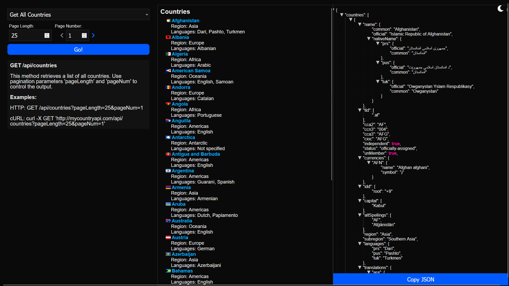
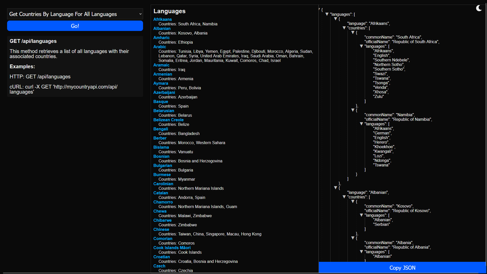

## Installation

#### We'll use NGINX as the web server.  Make a directory for the files, in this case /var/www/html/CountriesREST 

#### We'll use NGINX as the web server. Make a directory for the files, in this case `/var/www/html/CountriesREST` 

```sh
sudo mkdir -p /var/www/html/CountriesREST
```

Copy the HTML and PHP files into the directory:

```sh
sudo chmod -R 755 /var/www/html/CountriesREST
sudo chown -R www-data:www-data /var/www/html/CountriesREST
```

Edit the NGINX site configuration:

```sh
sudo nano /etc/nginx/sites-available/countryAPI.com
```

Paste the contents from `nginxSiteConfig.txt` from this repo into this new site configuration file. Make sure to change the domain name to match your domain.

Make sure you have NGINX and PHP-FPM installed, and use the correct path to the `php-fpm.sock`, for example:

```sh
unix:/run/php/php7.4-fpm.sock;
```

Create a symbolic link to enable the site:

```sh
sudo ln -s /etc/nginx/sites-available/countryAPI.com /etc/nginx/sites-enabled/countryAPI.com
```

Restart NGINX:

```sh
sudo service nginx restart
```
 
## API Endpoints

### 1. `GET /api/countries`
Fetch a paginated list of all countries.

#### Optional Query Parameters:
- `pageLength` (int): Number of countries per page. Default is 25.
- `pageNum` (int): Page number to retrieve. Default is 1.

#### Response:
A JSON object containing:
- `countries`: List of countries for the current page.
- `page`: Current page number.
- `nextPageUrl`: URL to the next page if available.
- `total`: Total number of countries.
- `pages`: Total number of pages.

### 2. `GET /api/countries/{countryCode}`
Fetch details for a specific country by its code.

#### Path Parameter:
- `countryCode` (string): The ISO 3166-1 alpha-2 or alpha-3 country code.

#### Response:
A JSON object containing the details of the requested country.

### 3. `GET /api/countries/name/{name}`
Fetch countries by name.

#### Path Parameter:
- `name` (string): The name of the country.

#### Optional Query Parameters:
- `fullText` (bool): Whether to match the full name. Default is false.

#### Response:
A JSON object containing a list of countries that match the name.

### 4. `GET /api/regions`
Fetch all countries grouped by their region.

#### To Limit Response To A Single Region: http://mycountryapi.com/api/regions/name/america
- `region` (string): The name of the region to filter by.

#### Response:
A JSON object with countries grouped by their region.

### 5. `GET /api/languages`
Fetch all countries grouped by the language spoken.

#### To Limit Response To A Single Language: http://mycountryapi.com/api/languages/name/engish
- `language` (string): The name or code of the language to filter by.

#### Response:
A JSON object with countries grouped by their primary language.


## PHP API

In addition to the REST API, this package is also designed to give PHP developers full access to the API via the CountriesAPI.php script.

### Instantiation

To use the `CountriesAPI` class, you need to instantiate it as follows:

```php
$countriesAPI = new CountriesAPI();
```

### Methods

#### `getCountryByCode($code)`

Fetch a single country based on its code.

**Parameters:**
- `$code` (string): Country code.

**Returns:**
- An array containing country data.

**Example:**
```php
$result = $countriesAPI->getCountryByCode('AW');
print_r($result);
```

#### `getCountries($options = array())`

Fetch all countries according to the provided options.

**Parameters:**
- `$options` (array): Optional. Can contain:
  - `name` (string): Country name to search.
  - `fullText` (boolean): Whether to search for the full name (default: false).

**Returns:**
- An array containing countries data.

**Example:**
```php
// Get all countries
$result = $countriesAPI->getCountries();

// Get countries by name
$result = $countriesAPI->getCountries(['name' => 'Netherlands']);
```

#### `getCountriesPaginated($options = array())`

Fetch countries with pagination support.

**Parameters:**
- `$options` (array): Optional. Can contain:
  - `pageLength` (int): Number of countries per page (default: 25).
  - `pageNum` (int): Page number to fetch (default: 1).

**Returns:**
- An array containing paginated countries data.

**Example:**
```php
$result = $countriesAPI->getCountriesPaginated(['pageNum' => 2, 'pageLength' => 10]);
print_r($result);
```

#### `getCountriesByRegions($options = array())`

Fetch countries grouped by their regions.

**Parameters:**
- `$options` (array): Optional. Can contain:
  - `region` (string): Region name to filter by.

**Returns:**
- An array containing grouped countries data by region.

**Example:**
```php
// Get countries grouped by regions
$result = $countriesAPI->getCountriesByRegions();
print_r($result);

// Get countries by specific region
$result = $countriesAPI->getCountriesByRegions(['region' => 'Asia']);
print_r($result);
```

#### `getCountriesByLanguages($options = array())`

Fetch countries grouped by their main languages.

**Parameters:**
- `$options` (array): Optional. Can contain:
  - `language` (string): Language name or code to filter by.

**Returns:**
- An array containing grouped countries data by languages.

**Example:**
```php
// Get countries grouped by languages
$result = $countriesAPI->getCountriesByLanguages();
print_r($result);

// Get countries by specific language
$result = $countriesAPI->getCountriesByLanguages(['language' => 'Spanish']);
print_r($result);
```

## API Browser

Also included is a complete API browser which can be used to try out the various supported methods.  Just open the url for your APIBrowser.html file in any browser.  Here are some screenshots:

#### Get Countries For Region


#### Get All Countries



#### Search Countries By Keyword


#### Lookup Country By Name


#### Get Countries By Language All Languages



#### Get Countries For Language


#### Get Countries By Region For All Regions


